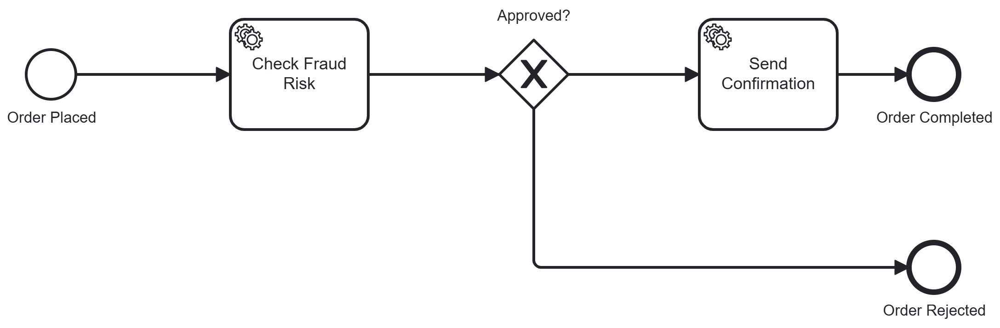

# Order Processing Service - Camunda 8 & Spring Boot PoC

A Proof of Concept (PoC) demonstrating an event-driven order processing workflow using **Java 17**, **Spring Boot 3.2.3**, and **Camunda 8 (Zeebe 8.5.0)**.

This service separates business process orchestration (managed by Zeebe Engine) from business execution (handled by Spring Boot Job Workers), adhering to Clean Code and SOLID principles.

---

## 🛠️ Architecture & Technology Stack

* **Language & Framework:** Java 17 / Spring Boot 3.2.3
* **Workflow Engine:** Camunda 8 (Zeebe 8.5.0) via `spring-boot-starter-camunda-sdk`
* **Containerization:** Docker
* **Communication Protocol:** gRPC (Port 26500) for Zeebe broker communication, HTTP/REST (Port 8081) for external REST API endpoints.

---

## 📐 Key Architectural Decisions

### 1. Choice of Technology & SDK
* **Java 17 & Spring Boot:** Selected for enterprise reliability, robust dependency management, and integration with the official `spring-boot-starter-camunda-sdk`.
* **Stateless Job Workers:** Workers poll tasks from the Zeebe engine asynchronously via gRPC. Holding no local state enables horizontal scaling across multiple application instances.

### 2. Single Responsibility Principle (SRP)
* **Isolated Workers:** Created dedicated job workers for distinct domain concerns:
  * `FraudCheckWorker`: Evaluates risk scores and determines order approval.
  * `NotificationWorker`: Handles post-approval notifications.
* **Separation of Concerns:** `OrderController` acts strictly as an API entry point, delegating orchestration to the Zeebe engine via `ZeebeClient`.

### 3. Type Safety with Java Records
* Utilized Java 17 Records (`OrderRequest`) as DTOs for REST endpoints to establish clear API contracts and compile-time type safety.

---

## 🔄 BPMN Process Design



The workflow (`order-processing-process.bpmn`) models an order validation and fulfillment flow:

1. **Start Event (`Order Placed`):** Triggered via REST API or Camunda Modeler.
2. **Service Task (`Check Fraud Risk`):** Executed by `fraud-check-worker` to evaluate `orderValue`.
3. **Exclusive Gateway (`Approved?`):**
   * **Sequence Flow (`isApproved == true`):** Routes to Service Task `Send Confirmation` (`notification-worker`), completing at `Order Completed`.
   * **Sequence Flow (`isApproved == false`):** Routes directly to End Event `Order Rejected`.

---

## 🛡️ Error Handling & Business Validation

* **Defensive Application Validation:** Invalid inputs (e.g., `null` or `orderValue <= 0`) are validated directly within `FraudCheckWorker`.
* **Graceful Flow Control:** Rather than throwing runtime exceptions, the worker outputs `isApproved: false` with `riskScore: "REJECTED_INVALID_INPUT"`, cleanly driving the BPMN process down the rejection path.

---

## 🚀 How to Run & Test

### Prerequisites
* JDK 17
* Apache Maven 3.8+
* Docker

### Step 1: Start Local Zeebe Broker
```bash
docker compose up -d
```
### Step 2: Build and Run Spring Boot Application
```bash
mvn clean spring-boot:run
```
### Step 3: Test via REST API (cURL)
Scenario A: Approved Order (orderValue < 1000)

```bash
curl -X POST http://localhost:8081/api/orders \
  -H "Content-Type: application/json" \
  -d '{"orderValue": 500.0}'
```
Scenario B: High Risk / Rejected Order (orderValue >= 1000)
```bash
curl -X POST http://localhost:8081/api/orders \
  -H "Content-Type: application/json" \
  -d '{"orderValue": 1500.0}'
```

### Step 4: Test via Camunda Desktop Modeler
1. Open src/main/resources/bpmn/order-processing-process.bpmn in Camunda Desktop Modeler.

2. Click Start Instance (Play icon) connected to localhost:26500.

3. Input payload:

```JSON
{
  "orderValue": 500.0
}
```
4. Observe job worker logs in your Spring Boot terminal.